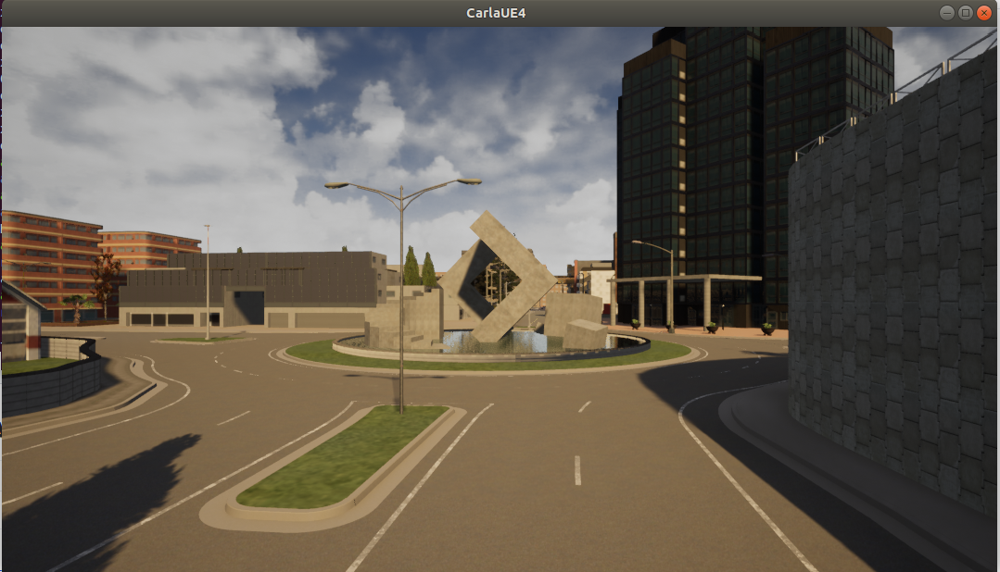
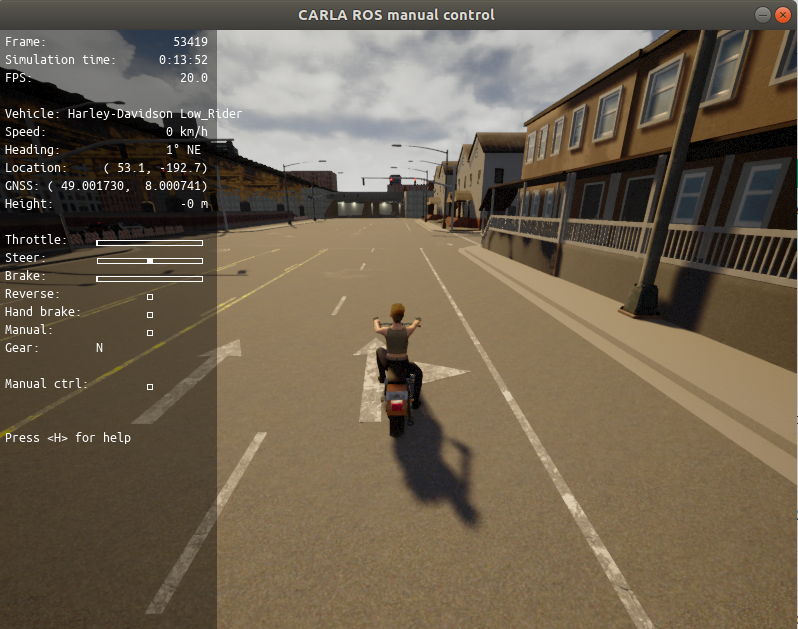

# ROS-AD-SLAM-Evaluation

## How to setup Carla Environment to replicate the test results

### Requirements

  - Ubuntu 18.04.
  - 16gb RAM.
  - Vulkan enabled GPU is preferred , Follow the [LINK](https://vulkan.gpuinfo.org/) to check your GPU compatibility.
  - Unreal Engine 4.24 , for build instructions follow [LINK](https://carla.readthedocs.io/en/stable/how_to_build_on_linux/#build-unreal-engine).
  - Carla 0.9.8, for build instructions follow [LINK](https://carla.readthedocs.io/en/stable/how_to_build_on_linux/#How%20to%20build%20CARLA%20on%20Linux).
  - ROS Melodic , for install instructions follow [LINK](http://wiki.ros.org/melodic/Installation/Ubuntu).

### Setup the ROS Environment

  - Navigate to carla build directory , you should find `*.egg` file in `carla/Dist/CARLA_Shipping_0.9.8-***********/LinuxNoEditor/PythonAPI/carla/dist/` folder, which to be exported to python environment to run further simulations. Make sure you export appropiate egg file based on your preferred python version.
  - Install SLAM Nodes
        - Install Gmapping by `sudo apt-get install ros-melodic-slam-gmapping`.
        - Install Hector SLAM by `sudo apt-get install ros-melodic-hector-slam`.
        - Install RTAB-Map by `sudo apt-get install ros-kinetic-rtabmap-ros`.
        - Karto SLAM needs to be build from the source , follow standard ROS package installation procedure. The Kartoslam Github repo can be found [LINK](https://github.com/ros-perception/slam_karto).
  - Clone the SLAM packages `https://github.com/prithvisekhar/ROS-AD-SLAM-Evaluation.git`
  - Copy the ros-bridge contents to a ros workspace `src` folder and build the workspace and source the workspace before running the `roscore`.

### Running the Simulator

  - Run Carla simulator by navigating to `carla/Dist/CARLA_Shipping_0.9.8-***********/LinuxNoEditor/` and running `./CarlaUE4.sh` if you are using `opengl` then you should pass `-opengl` as configuration along with the carla launch command.
it should open the simulator (Refer the below image as reference). For More info on graphics support follow this [LINK](https://carla.readthedocs.io/en/latest/adv_rendering_options/)

- Run the Carla ROS Client `roslaunch carla_ros_bridge carla_ros_bridge_with_example_ego_vehicle.launch` , Refer the below image as reference

  - Run the Gmapping Node `roslaunch carlabg Gmapping_Carla.launch` , for configuration option see `ros-bridge/carlabg/launch` folder. After mapping session is over save the map using map_saver tool `rosrun map_server map_saver -f /path to your file`.
  - Run the Hector SLAM Node `roslaunch carlabg Hectormapping_Carla.launch`. Follow the same map saver command to save the map for Hector SLAM.
  - Run the Karto SLAM Node `roslaunch carlabg KartoSLAM2.launch`. Follow the same map saver command but this time pass the map frame as `map2`.
  - Launch the RTAB-Map Node `roslaunch carlabg RtabMapping_Carla.launch`. RTAB Map can be directly saved from the RTAB map application.
